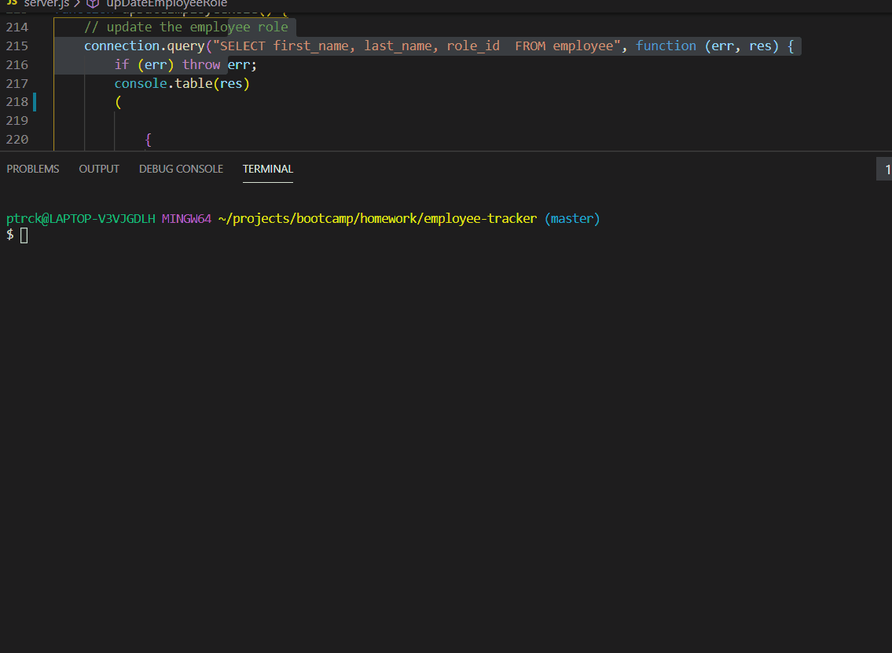

# employee-tracker

## Description 
As a business owner I want to be able to view and manage the departments, roles, and employees in my company So that I can organize and plan my business.

## Installation 
If all the files are kept in a single fold and the user access to the terminal they will be able to run the application.  

## Usage
The usage was to practice using Nodd.js and SQL.  

## Credit
I created this project from the outline given to me by my Triology Education Services instructor. I also took code from my homework and in class activities. I had help from my tutors Isabel Arcone and Andy Gikling. 

## Contributing 
I built this application own my own. But I had help I from my instructor, TAs, classmates and tutors.

## Challenges
I had a hard to with my functions becoming nested. When I was trying to figure out how to add a new employee I kept on nesting my "inquirer.prompt". It got to the point where I couldn't figure out where to add or end functions. I had to delete the code and redo it. It made more sense to use an array of objects to ask the questions and pass the answers. I also needed help passing the varible in the corect format. My classmate Michelle Owodunni had to help me with this.    

## GIF of application working

## License
[MIT](https://choosealicense.com/licenses/mit/)